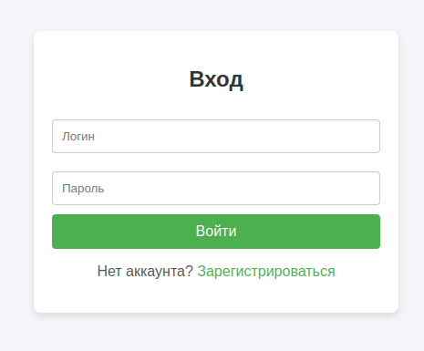
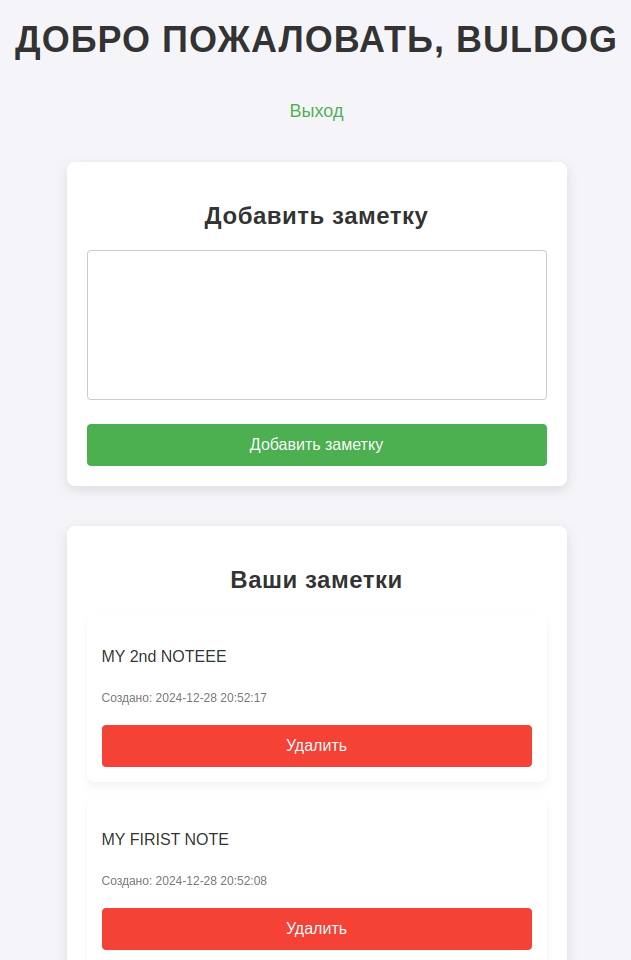
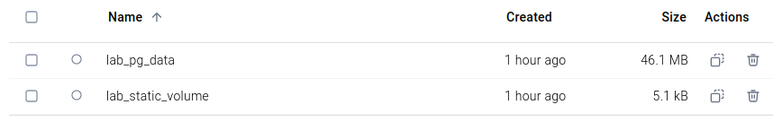
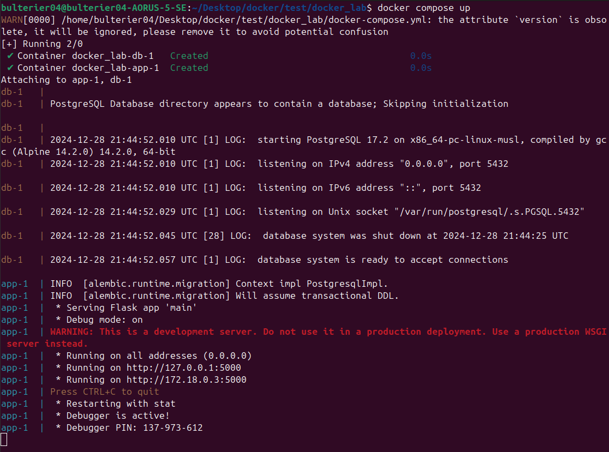

# Docker Lab

Для запуска проекта необходимо выполнить следующие действия:

1. Клонируйте репозиторий:
   ```bash
   git clone https://github.com/bulterier94/docker_lab.git
   cd docker_lab/
   ```

2. Запустите проект:
   ```bash
   docker compose up
   ```

3. Приложение будет доступно по адресу:
   ```
   http://localhost:5000
   ```
---

## Задание
Цель лабораторной работы: собрать из исходного кода и запустить в Docker рабочее приложение с базой данных (любое open-source на выбор: Java, Python/Django/Flask, Golang).

### Требования:
1. Образ должен быть **легковесным**.
2. Использовать базовые **легковесные образы** (например, Alpine).
3. Вся конфигурация приложения должна быть реализована через **переменные окружения**.
4. **Статика** (зависимости) должна быть вынесена в **внешний том** (`volume`).
5. Создать файл `docker-compose.yml` для **сборки** и **запуска** приложения.
6. В `docker-compose.yml` необходимо использовать базу данных (например, PostgreSQL, MySQL, MongoDB и т.д.).
7. При старте приложения должны быть учтены **автоматические миграции**.
8. Контейнер должен запускаться от **непривилегированного пользователя**.
9. После установки всех необходимых утилит, должен **очищаться кеш**.

---

## Описание функционала

Реализация представлена на Python (Flask) и использует базу данных PostgreSQL.
Мини-приложение позволяет управлять заметками, которые доступны только авторизованным пользователям. Реализованы следующие возможности:

- **Возможность создать аккаунт** для записи своих заметок.
- **Добавление новых заметок**.
- **Удаление заметок**.
- **Просмотр списка созданных в аккаунте заметок**.

### Веб-интерфейс:
1. Страница авторизации:

   
   
2. Главная страница:
   
   

---

## Структура проекта

1. **Сервис `app` (Flask-приложение)**:
   - Использует легковесный образ **Python 3.13 Alpine**.
   - Конфигурация осуществляется через **переменные окружения**, определённые в `docker-compose.yml`:
     - `SECRET_KEY`: секретный ключ для Flask.
     - `SQLALCHEMY_DATABASE_URI`: строка подключения к базе данных.
     - `FLASK_ENV`: режим работы приложения (`development`).
     - `APP_HOST` и `APP_PORT`: адрес и порт для запуска.
   - Обрабатывает автоматические миграции при запуске.
   - Монтирует следующие тома:
     - **`static_volume:/app/static`**: хранение статических файлов.
     - **`.:/app`**: для разработки.
   - Запускается от **непривилегированного пользователя**.

2. **Сервис `db` (PostgreSQL)**:
   - Используется легковесный образ **PostgreSQL 17 Alpine**.
   - Хранение данных вынесено в том `pg_data`.
   - Конфигурируется через переменные окружения:
     - `POSTGRES_USER`: пользователь базы данных.
     - `POSTGRES_PASSWORD`: пароль.
     - `POSTGRES_DB`: имя базы данных.
   - Автоматически перезапускается в случае сбоя.

---

## Dockerfile

Контейнер Flask-приложения собирается из **Python 3.13 Alpine** для минимизации размера. 

```dockerfile
FROM python:3.13-alpine

# Создаём непривилегированного пользователя
RUN addgroup -S appgroup && adduser -S appuser -G appgroup

# Устанавливаем рабочую директорию
WORKDIR /app

# Копируем зависимости
COPY requirements.txt .

# Устанавливаем зависимости и очищаем кеш
RUN pip install --no-cache-dir -r requirements.txt

# Копируем приложение
COPY . .

# Копируем скрипт запуска
COPY entrypoint.sh /entrypoint.sh
RUN chmod +x /entrypoint.sh

# Переходим на непривилегированного пользователя
USER appuser

# Указываем точку входа
ENTRYPOINT ["/entrypoint.sh"]
```

**Содержимое `entrypoint.sh`:**
```sh
#!/bin/sh

if [ ! -d "/app/migrations" ]; then
    alembic init migrations
    echo "Migrations initialized"
fi

alembic upgrade head

rm -rf /app/migrations/__pycache__

python main.py

exec "$@"
```

---

## Docker Compose

Файл `docker-compose.yml` обеспечивает одновременный запуск приложения и базы данных.

```yaml
version: '3.9'

services:
  app:
    build: .
    environment:
      SECRET_KEY: "123"
      SQLALCHEMY_DATABASE_URI: "postgresql+psycopg2://bulterier04:123@db:5432/notes_db"
      FLASK_ENV: "development"
      APP_HOST: 0.0.0.0
      APP_PORT: 5000
    depends_on:
      - db
    volumes:
      - .:/app
      - static_volume:/app/static
    ports:
      - "5000:5000"

  db:
    image: postgres:17-alpine
    environment:
      POSTGRES_USER: bulterier04
      POSTGRES_PASSWORD: 123
      POSTGRES_DB: notes_db
    volumes:
      - pg_data:/var/lib/postgresql/data
    ports:
      - "5432:5432"
    restart: always

volumes:
  static_volume:
  pg_data:
```

---

## Тома

Статика (файлы стилей css) была вынесена в отдельный том.



---

---

## Запуск проекта

Пример запуска программы:




